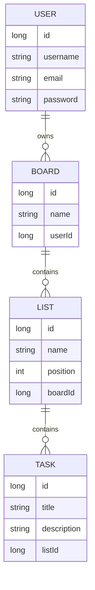
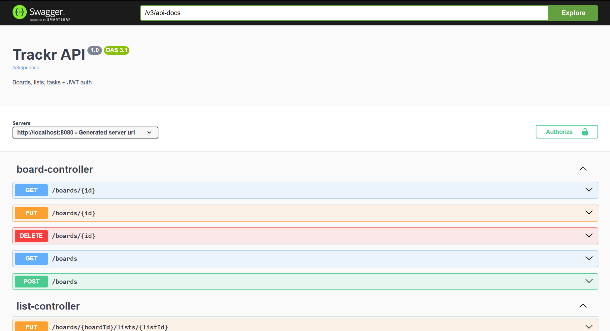
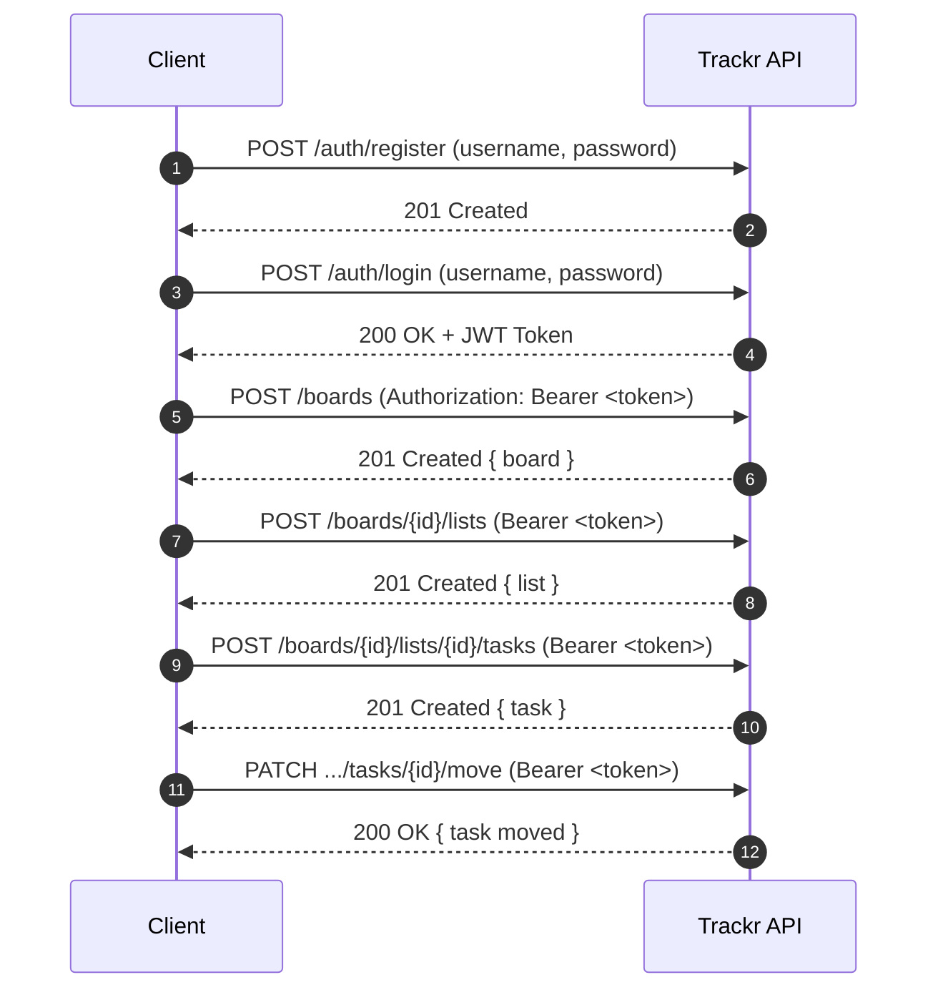

# Trackr-Api

> Backend API tipo Trello para manejar **Boards → Lists → Tasks**, con **JWT Auth**, **PostgreSQL** y **Swagger UI**.  
> Incluye **tests** y **CI (GitHub Actions)** para validar automáticamente que cada cambio no rompa el sistema.


---

## Data Model



---

## Tech Stack

- Java 17
- Spring Boot
- Spring Security (JWT)
- Spring Data JPA
- PostgreSQL (Docker) para desarrollo
- H2 (in-memory) para tests y CI
- Swagger / OpenAPI
- Postman

---

## Requisitos

Para correr el proyecto necesitas:

- Java 17
- Maven
- Docker Desktop
- Postman (opcional)

---

## Ejecutar el proyecto localmente

### 1. Levantar la base de datos (PostgreSQL)

En la raíz del proyecto:

```bash
docker compose up -d
```

Esto inicia PostgreSQL en Docker.

### 2. Correr el backend

```bash
mvn spring-boot:run
```

La API quedará corriendo en:

```
http://localhost:8080
```

---

## Swagger UI

Documentación interactiva de la API:

```
http://localhost:8080/swagger-ui/index.html
```



### Usar autenticación JWT en Swagger

1. Ejecuta `POST /auth/login` o `POST /auth/register`
2. Copia el token que devuelve
3. Presiona **Authorize** en Swagger
4. Pega el token JWT

---

## Autenticación JWT



---

## Usar Postman

En la carpeta `postman/` están los archivos:

- `TrackrApi.postman_collection.json`
- `Local.postman_environment.json`

Importa ambos en Postman.

---

## Endpoints principales

### Auth

```
POST /auth/register
POST /auth/login
GET  /me
```

### Boards

```
POST   /boards
GET    /boards
GET    /boards/{id}
PUT    /boards/{id}
DELETE /boards/{id}
```

### Lists

```
POST   /boards/{boardId}/lists
GET    /boards/{boardId}/lists
PUT    /boards/{boardId}/lists/{listId}
DELETE /boards/{boardId}/lists/{listId}
```

### Tasks

```
POST   /boards/{boardId}/lists/{listId}/tasks
GET    /boards/{boardId}/lists/{listId}/tasks
PUT    /boards/{boardId}/lists/{listId}/tasks/{taskId}
DELETE /boards/{boardId}/lists/{listId}/tasks/{taskId}
PATCH  /boards/{boardId}/lists/{listId}/tasks/{taskId}/move
```

---

## Tests

Para correr los tests localmente:

```bash
mvn test
```

✅ Los tests usan **H2 in-memory database**, por lo que no dependen de PostgreSQL.

---

## CI (GitHub Actions)

Cada vez que se hace un `push` o `pull request`, GitHub Actions ejecuta automáticamente:

```bash
mvn test
```

Si los tests fallan, el pipeline marca error. Esto asegura que el código siempre se mantenga estable.